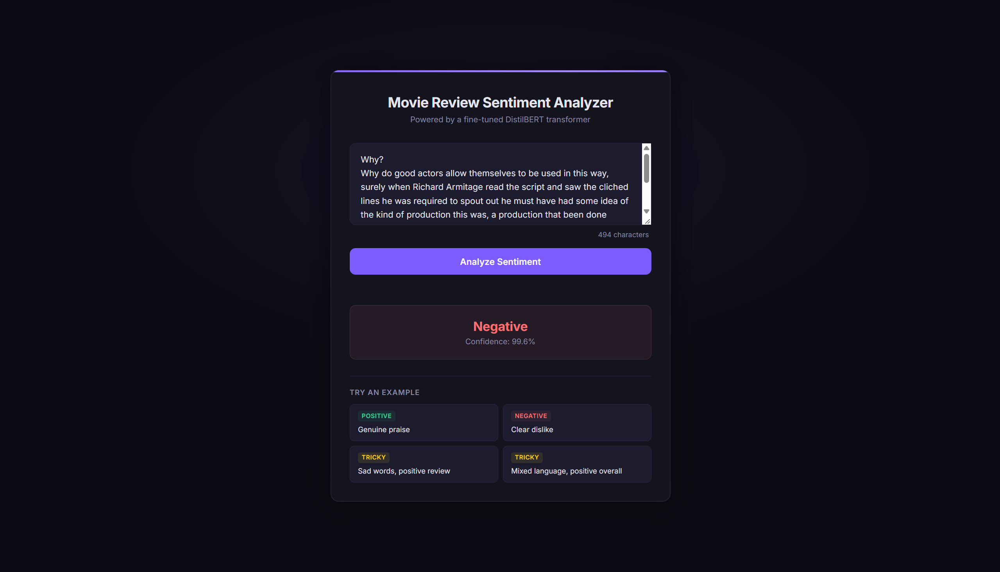
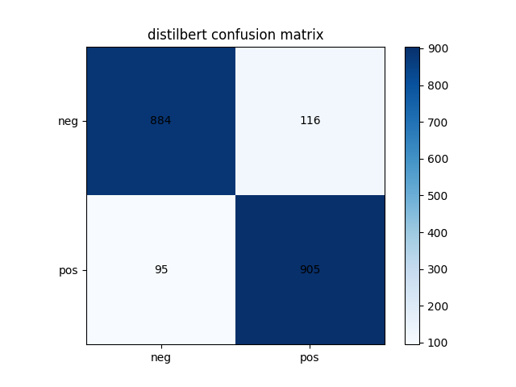

# IMDB Sentiment: TF-IDF vs Fine-Tuned DistilBERT

A binary sentiment classifier (positive/negative) on IMDB movie reviews, comparing a classical TF-IDF + LinearSVC baseline against a fine-tuned DistilBERT transformer, served through a FastAPI endpoint.



## Why

The Twitter sentiment project showed how far a classical TF-IDF model can go. This project asks the next question: how much does a transformer actually buy you, and what kinds of sentences does it get right that TF-IDF gets wrong?

## Dataset

[IMDB Movie Reviews](https://huggingface.co/datasets/imdb) — 25,000 train / 25,000 test, balanced positive/negative.

DistilBERT was fine-tuned on an 8,000-example subset of train (2,000 for eval) to keep training time reasonable; the baseline was trained on the full 25,000.

## Results

| Model | Accuracy | F1 |
|---|---|---|
| TF-IDF + LinearSVC (full 25k train) | 87.0% | 0.869 |
| **DistilBERT, fine-tuned (8k subset)** | **89.5%** | **0.896** |

DistilBERT won by about 2.5 points on both metrics despite training on less than a third of the data the baseline used (8k vs 25k reviews) — a fairer, same-size comparison would likely widen this gap further in DistilBERT's favor.

## What DistilBERT gets that TF-IDF misses

Every disagreement sampled followed the same pattern: reviews that are clearly positive overall, but use negative-sounding words along the way (e.g. *"really sad, and touching movie... deals with the subject of child abuse... mostly a true story"* — a review that calls the film one of the best despite heavy, sad subject matter).

TF-IDF treats words independently and scores based on raw frequency, so words like "sad," "touching," and "abuse" register as negative signal regardless of how they're actually used in context — it misclassified all three examples as negative. DistilBERT's attention mechanism considers words in relation to each other, so it can learn that negative-sounding words get recontextualized by surrounding praise ("sad... but... one of the best"). TF-IDF has no mechanism for that; it's bag-of-words, with no notion of word order or relationships between words.

**Example:**
> "After a very long time Marathi cinema has come with some good movie. This movie is one of the best Marathi movies ever made. It shows how a old grandfather tries to save his grandsons eye..."

Actual: Positive · Baseline: Negative · DistilBERT: Positive

## Confusion matrix



## API

**POST** `/predict`

```json
{ "text": "A slow start but the ending genuinely surprised me." }
```

```json
{ "text": "...", "sentiment": "Positive", "confidence": 0.91 }
```

## Run locally

```bash
git clone https://github.com/varun-aahil/distilbert-imdb-sentiment-analysis.git
cd <distilbert-imdb-sentiment-analysis>
pip install -r requirements.txt   
uvicorn main:app --reload
```

## Tech stack

Python, PyTorch, Hugging Face Transformers, scikit-learn, FastAPI

## Limitations and next steps

- Fine-tuned on a subset, not the full training set, for training-time reasons; retraining on the full 25k would likely improve both models slightly.
- No handling of reviews longer than 256 tokens beyond truncation, which could lose information from long reviews.
- Could add a calibration check to see if confidence scores are meaningfully higher on correct predictions.